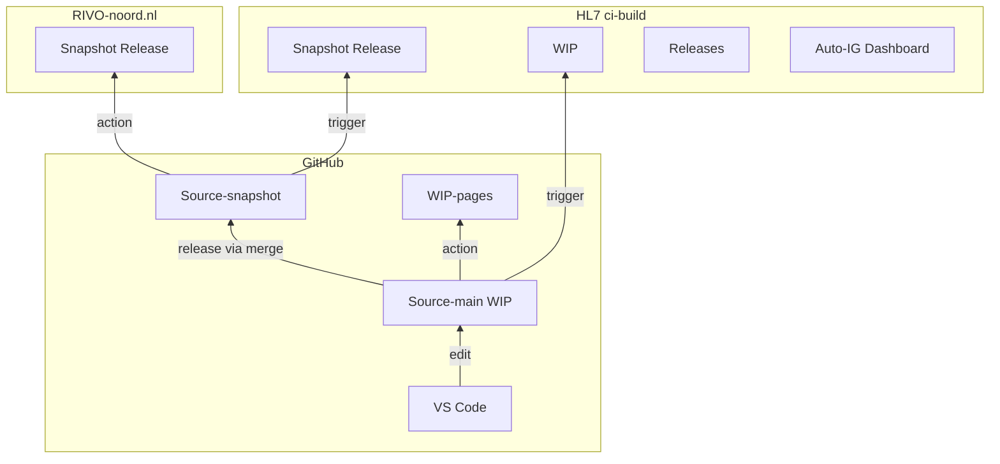

## Zorgviewer-IG output

* [Official Snapshot laatste release](https://implementatiegids.zorgviewer.nl/) of [Snapshot Release](https://build.fhir.org/ig/RIVO-Noord/zorgviewer-ig/branches/snapshot/)
* [HL7 FHIR CI Build](https://build.fhir.org/ig/RIVO-Noord/zorgviewer-ig/) of [RIVO CI Build](https://rivo-noord.github.io/zorgviewer-ig/)
* [Web-based VS Code](https://github.dev/RIVO-Noord/zorgviewer-ig/)
* [HL7 Auto-IG build dashboard](https://fhir.github.io/auto-ig-builder/)
* [Releases](https://build.fhir.org/ig/RIVO-Noord/zorgviewer-ig/branches/)



## Validate resources
```
(initial) > curl -L https://github.com/hapifhir/org.hl7.fhir.core/releases/latest/download/validator_cli.jar -o input-cache/validator_cli.jar
> java -jar input-cache/validator_cli.jar -version 3.0.2 input/resources -ig input/resources -ig nictiz.fhir.nl.stu3.zib2017
```

## To build the IG (need minimal version 1.2.31 dd 1-feb-2023 ivm zib2017 package fix)
```
(initial) (Bash) > curl -L https://github.com/HL7/fhir-ig-publisher/releases/latest/download/publisher.jar -o input-cache/publisher.jar
(initial) (Powershell) > Invoke-WebRequest -Uri "https://github.com/HL7/fhir-ig-publisher/releases/latest/download/publisher.jar" -OutFile "input-cache/publisher.jar"
> java -jar input-cache/publisher.jar -ig ig.ini
```

### Trigger FHIR auto-ig builder
```
curl -X POST  "https://us-central1-fhir-org-starter-project.cloudfunctions.net/ig-commit-trigger" \
  -H "Content-type: application/json" \
  --data '{"ref": "refs/heads/snapshot", "repository": {"full_name": "RIVO-Noord/zorgviewer-ig"}}'
```

## Stappen publiceren IG vanuit git

### Lokaal

1. (optioneel) maak de docker om de IG lokaal te bouwen
Download de Debian jdk van https://www.oracle.com/java/technologies/downloads/?er=221886#jdk21-linux
```
> cd {zorgviewer-ig}
> (Bash) docker run --name=zv -it -v "$(pwd)":/app ubuntu:latest /bin/bash
> (Powershell) docker run --name=zv -it -v ${PWD}:/app ubuntu:latest /bin/bash
@> cd /app
@> apt update
@> apt install jekyll graphviz
@> dpkg -i jdk-24_linux-x64_bin.deb
```
1. (optioneel) bouw lokaal de IG en check output - zie "To build the IG"

### Afhechten van een Release

1. Werk de volgende files bij: 
    1. ``input/pagecontent/changes.md`` (github links, comparison version en change bullets)
    1. ``input/images/package-feed.xml`` (datum, versie, IG publisher versie; zodat nieuwe versie opgenomen wordt in de fhir package registries)
    1. ``fhir.hl7.nl/package-list.json`` (datum, versie, IG publisher versie en upload naar fhir.hl7.nl/zorgviewer; used for version comparison!)
    1. ``publication-request.json`` (versie, sequence, description=beknopt changes); nodig voor go-publish
1. (optionally) Generate changelog using Gemini
    1. First update tags `> git pull`
    1. Then use `gemini` (CLI) with the following prompt: `Generate a changelog for the changes from the last tag up to the HEAD and summerize this in a short bullet list in Dutch`
    1. Plaatst output onder "Laatste Wijzigingen" in `changes.md`
1. ``> git commit -a -m "afhechten release 1.M.R"; git push``
1. Create tag "1.M.R-sprintX" - op https://github.com/RIVO-Noord/zorgviewer-ig klik op: 
    1. Tags
    1. Releases
    1. Draft new release
    1. Choose a tag: "1.M.R"
    1. Create a new tag
    1. Release title: "1.M.R"
    1. Description: generate release notes -> "{github changes link}"
    1. Vink aan: Set as the latest release
    1. Publish release
1. update https://github.com/FHIR/ig-registry/blob/master/fhir-ig-list.json; nodig voor https://www.fhir.org/guides/registry/
    Edit file in your fork and create a PR.

### Vrijgeven van de laatste Release

1. Publish naar implementatiegids.zorgviewer.nl via snapshot branch
```
> cd {temp-folder}
(eerste keer: git clone https://github.com/RIVO-Noord/zorgviewer-ig.git ; git checkout snapshot)
> git pull
> git merge 1.M.R
```
1. Zet release label in zorgviewer-ig.json op "release"
```
> vi input/zorgviewer-ig.json
> git commit -a -m "publication 1.M.R"
> git push
```
1. En werk verder in de master branch
1. Update input/zorgviewer-ig.json 
  * version naar volgende minor "1.M+1.0" 
  * parameter/version-comparison-master naar (vorige versie) "1.M.0"
    * ook in input/pagecontent/changes.md

### Handmatig publish implementatiegids.zorgviewer.nl

N.B. Alleen nodig als de [GitHub Snapshot Publish Workflow](.github/workflows/publish.yml) niet werkt.

1. Maak nieuwe publicatie - zie "To build the IG"
1. Upload
```
> docker run --name azure-cli -it -v "$(pwd)":/app  mcr.microsoft.com/azure-cli
@> az storage blob upload-batch --overwrite -s /app/output -d '$web' --connection-string "..."
```

## Toevoegen publicatie aan de internationale Implementation Guide Registry

### Instructies

- https://registry.fhir.org/submit
- https://github.com/FHIR/ig-registry/blob/master/README.md

### package-feeds.json

Zorgt voor opname van de package in de 2 package registers:
- packages.fhir.org -> https://simplifier.net/packages
- http://packages2.fhir.org/packages/catalog

### fhir-ig-list.json

Zorgt voor beschikbaar komen in de searches:
- https://fhir.org/guides/registry/
- https://registry.fhir.org/

### EViews (hidden from menu)

Update inhoud van input/eviews.md middels volgende commando (manually remove extension):
```
> find temp/pages/_includes/ | fgrep -eview.xhtml | awk -F'[/-]' '{ print "### " $5 "\n"}'
```

## Some usefull resources

* Base standards
  * http://hl7.org/fhir/STU3/
  * http://hl7.org/fhir/smart-app-launch/1.0.0/
* IG Guidance
  * http://build.fhir.org/ig/FHIR/ig-guidance/
  * N.B. Basis van de IG tooling is R4. Dus ImplementationGuide gebruikt die. IG Tooling ondersteund STU3, R4, R5 voor content.
  * Auto IG Builder: https://github.com/FHIR/auto-ig-builder/blob/master/README.md
  * rivonoord-template/
    * http://build.fhir.org/ig/FHIR/ig-guidance/template.html
  * input/images-source/*.plantuml
    * https://plantuml.com/
    * Documentatie: https://crashedmind.github.io/PlantUMLHitchhikersGuide/
    * https://www.plantuml.com/plantuml/uml/
  * input/*/*.md
    * https://www.markdownguide.org/basic-syntax/
    * https://docs.github.com/en/get-started/writing-on-github/getting-started-with-writing-and-formatting-on-github/basic-writing-and-formatting-syntax 

## Known issues

### Sorting Artifacts edit; FIXED

In file template/scripts/createArtifactSumarry.xslt insert @ line 65: ``<xsl:sort select="f:name/@value"/>``

See https://github.com/HL7/ig-template-base/issues/227

FIXED: in official template now!

### dependsOn smart-on-fhir issue; STILL OPEN

Add to zorgviewer-ig.json, dependesOn smart not working now??? See issue in FHIR chat: https://chat.fhir.org/#narrow/stream/179166-implementers/topic/SMART-on-FHIR.20package.201.2E0.2E0.20is.20STU3.20or.20R4.3F
      {
        "uri": "https://simplifier.net/packages/hl7.fhir.uv.smart-app-launch/1.0.0",
        "packageId": "hl7.fhir.uv.smart-app-launch",
        "version": "1.0.0"
      }

### dependsOn hl7.terminology.r3#5.0.0 issue; FIXED

See issue in FHIR chat: https://chat.fhir.org/#narrow/stream/179252-IG-creation/topic/ValueSet-appropriateness-score.2Ejson.3A.20Unknown.20IdentifierUse.20c

Exception generating resource /home/michael/eclipse-workspace/zorgviewer-ig/input/resources/ValueSet-ACPTreatmentCodelist::ValueSet/ACPTreatmentCodelist: Error loading /home/michael/.fhir/packages/hl7.terminology.r3#5.0.0/package/CodeSystem-appropriateness-score.json: Unknown IdentifierUse code '?' (01:19.152)
org.hl7.fhir.exceptions.FHIRException: Error loading /home/michael/.fhir/packages/hl7.terminology.r3#5.0.0/package/CodeSystem-appropriateness-score.json: Unknown IdentifierUse code '?'

I worked around this Exception by replacing use="?" with use="official" in the local cache (hl7.terminology.r3#5.0.0):
1. hl7.terminology.r3#5.0.0/package/CodeSystem-appropriateness-score.json
2. hl7.terminology.r3#5.0.0/package/ValueSet-clinical-discharge-disposition.json
3. hl7.terminology.r3#5.0.0/package/ValueSet-appropriateness-score.json

WORKAROUND: Changing the dependsOn from (auto) hl7.terminology.r3#5.0.0 to hl7.terminology.r3#4.0.0 also seems to do the job.

UPDATE: fixed with hl7.terminology.r3#5.2.0 now!
